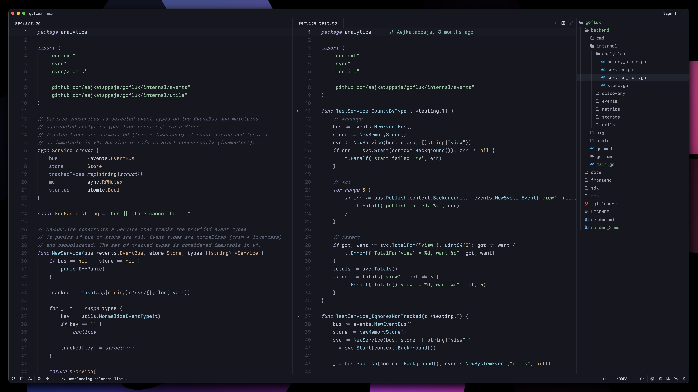

# Sora Theme for Zed

Zed editor port of [Sora](https://github.com/Aejkatappaja/sora) - a deep colorscheme with ethereal cyan, muted accents, and a near-black canvas.



## Install

1. Open Zed
2. `Cmd+Shift+P` → "zed: extensions"
3. Search "sora" → Install

Or manually clone into `~/.config/zed/extensions/`:

```sh
git clone https://github.com/Aejkatappaja/sora-theme.git ~/.config/zed/extensions/sora-theme

Then select the theme: Cmd+Shift+P → "theme selector" → Sora
```
